# word-auto 功能时序图（完整版）

> 日期：2026-06-10　配套：[`2026-06-10-enhancement-roadmap.md`](./2026-06-10-enhancement-roadmap.md)
> 覆盖**现有已实现功能**与**规划新功能**两大部分，用 Mermaid 时序图描述运行时交互。
> **仅为设计/说明，未写实现代码。** 不支持 Mermaid 渲染时，可读每图下方「说明」。

## 参与者图例

| 参与者 | 对应模块 | 状态 |
| --- | --- | --- |
| `App` / `RuleConfigPanel` / `ReportPanel` / `PreviewPanel` | `apps/web` 组件 | 现有 |
| `parseDocx` | `@word-auto/parser` 解析入口 | 现有 |
| `computeEffective` | `parser/resolve.ts` 样式继承 | 现有 |
| `classifyParagraphs` / `validateDoc` | `@word-auto/validator` | 现有 |
| `lintRuleLibrary` / `normalizeRuleLibrary` / `toLegacyRuleLibrary` | `validator` 规则模型 | 现有 |
| `docx-preview` | 第三方预览渲染 | 现有 |
| 草稿存储 / 生效规则库 / Web Worker / 候选提取器 / 批注导出器 | 路线图新增 | **新增** |

---

## 图 0　全局功能总览（导航图）

一张图把握整体：系统围绕 **parser（解析）→ validator（分类/校验/规则）→ Web（交互）** 三层，
分四条功能线；核心模块被多线复用——`parser`/`validator` 同时服务「检测」与「候选提取」，
规则库同时服务「配置」与「检测」。先看此图把握全局，再按需查阅对应分图。

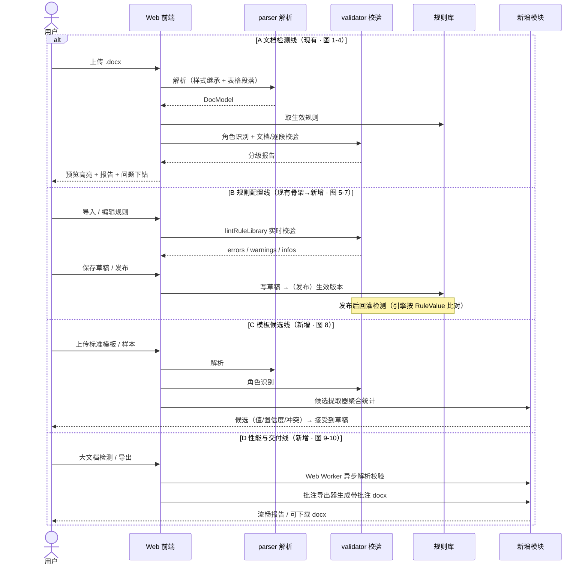

**说明**：四条线非互斥，是四类使用场景。关键复用关系——①`parser`+`validator` 被「检测」(A) 与
「候选提取」(C) 共用；②规则库被「配置」(B) 与「检测」(A) 共用，但 validator **只读生效规则**，
草稿/候选不参与检测；③新增模块(Worker/候选/批注)按场景挂载，不改变核心解析与校验链路。

---

# 第一部分　现有功能（已实现）

## 图 1　文档检测端到端主流程

四步流程：上传 → 选模板 → 配置 → 检测 → 预览 + 分级报告。

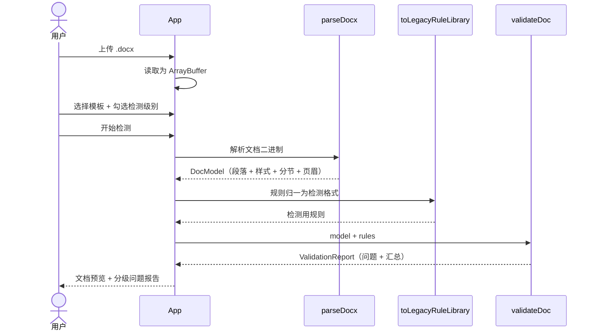

**说明**：纯前端、文件不离开浏览器。`validateDoc` 内部还会调角色识别与各检查器（见图 3）。

---

## 图 2　docx 解析管线 `parseDocx`（含表格段落提取）

解 zip → 主题/样式 → 逐段算有效格式 → **递归提取表格段落** → 分节与页眉。

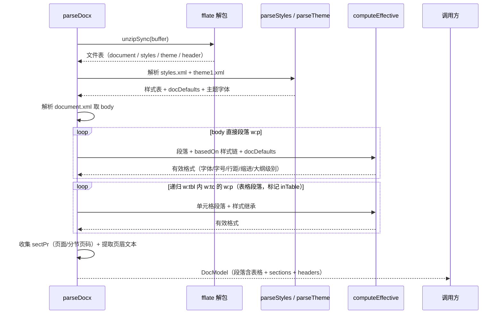

**说明**：①样式继承沿「直接格式→样式链→docDefaults」合并；②表格段落用同一套纯函数提取、标 `inTable`，追加到段落末尾（局部递归，未走全局 `preserveOrder`）。

---

## 图 3　校验流程 `validateDoc`（文档级 + 逐段）

先角色识别，再跑文档级检查与逐段格式比对；无规则的角色（如 `table_cell`）跳过。

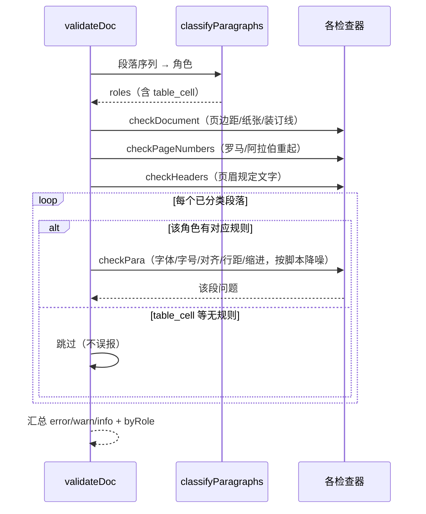

**说明**：角色识别是按文档顺序的状态机（标题关键词 > 封面区 > 目录样式 > 大纲级别 > 当前章节）；中文段不报西文字体、反之亦然（按脚本降噪）。

---

## 图 4　预览高亮与报告联动

`docx-preview` 渲染原貌 + 行距塌缩修补；点击问题按段落原文匹配定位高亮。

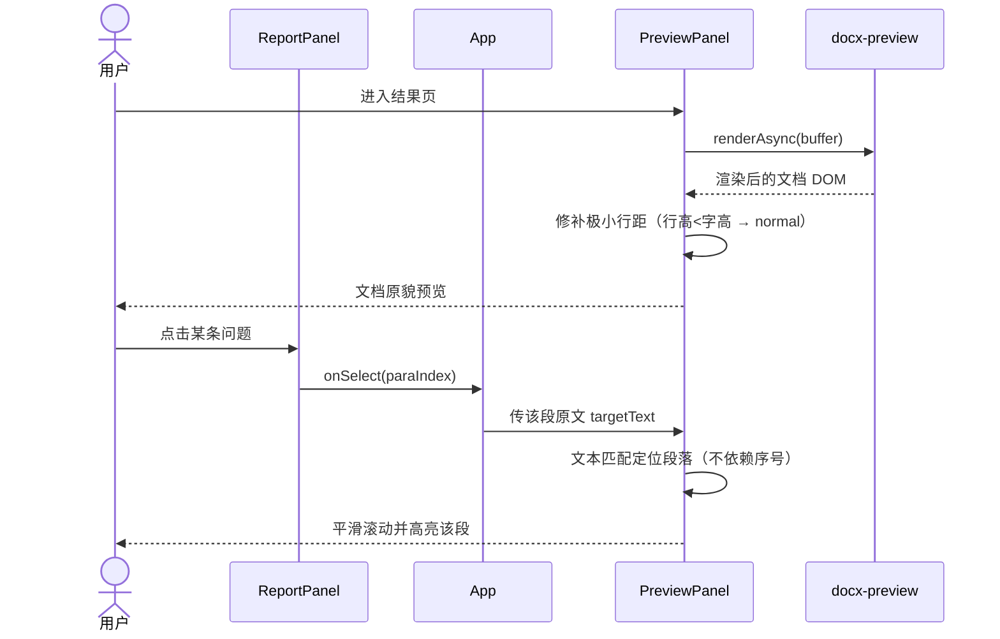

**说明**：高亮按段落原文匹配而非 DOM 序号，避免与渲染结构错位（详见 PROGRESS 渲染攻坚记录）。

---

## 图 5　规则配置页实时校验（已实现骨架）

载入模板可编辑副本 → 浏览/切换启用/改严重级别 → 实时跑 `lintRuleLibrary` 反馈。

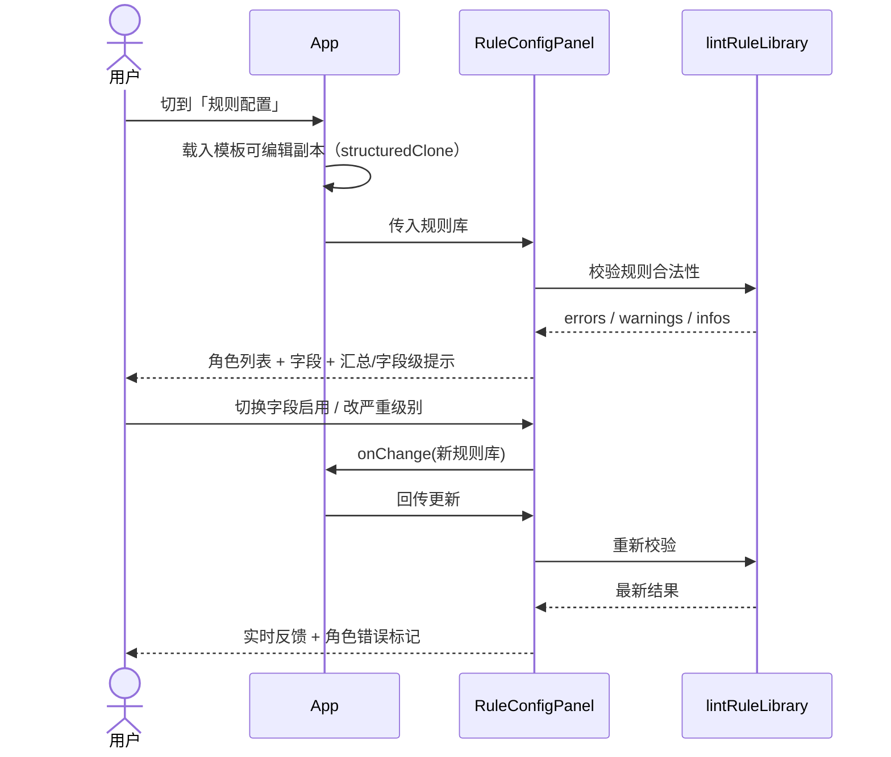

**说明**：当前值为只读展示；编辑只支持启用开关与严重级别。值编辑控件、草稿/发布见第二部分图 7。

---

# 第二部分　规划新功能

## 图 6　导入自定义规则库（roadmap §4）

上传 JSON → 去 BOM → 归一 → 合法性校验 → 载入或拒绝。

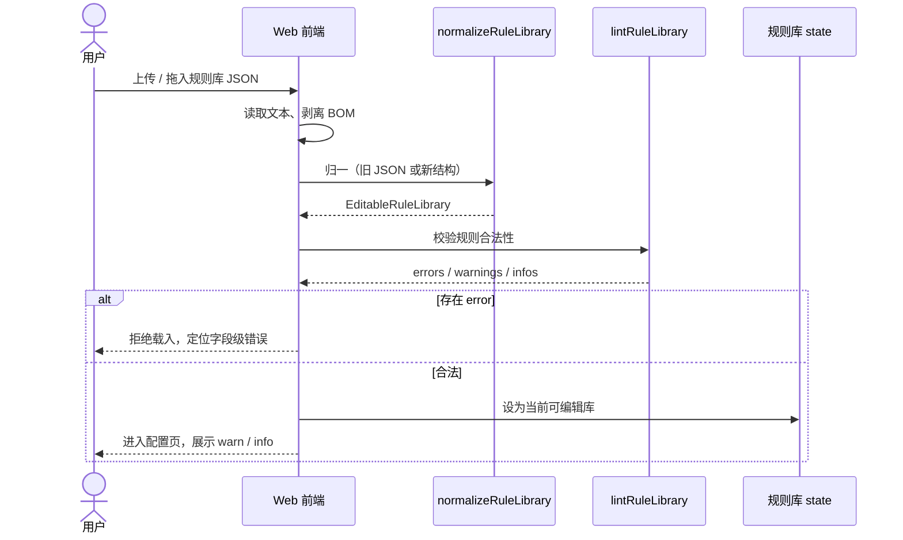

**说明**：复用现有 `normalizeRuleLibrary` + `lintRuleLibrary`，近乎零新逻辑即支撑多模板。

---

## 图 7　规则配置：草稿 → 发布 → 回灌检测（roadmap §3.3 + §4）

草稿/发布态分离 + 引擎对齐（检测直接消费 `RuleValue`，支持 `oneOf`/`range`）。

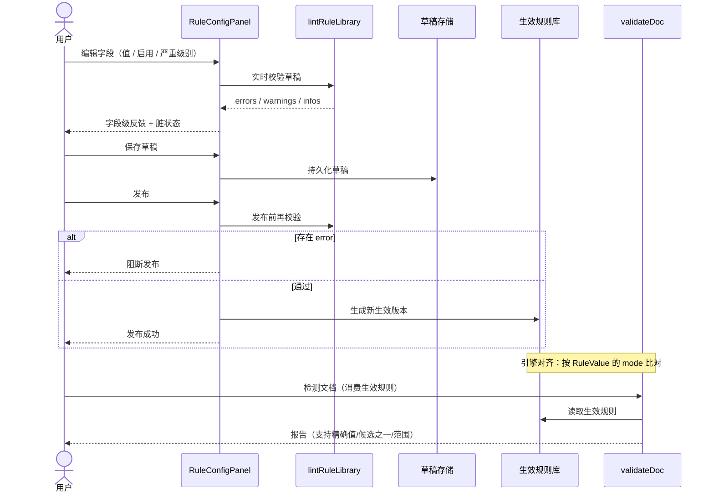

**说明**：草稿不影响检测，发布才回灌；修掉「配了 `oneOf`/`range` 却检测不到」的能力断层。

---

## 图 8　模板候选提取（roadmap §4 阶段 6-7）

上传模板 → 复用 parser+classify 聚合 → 候选规则 → 人工确认接受到草稿。

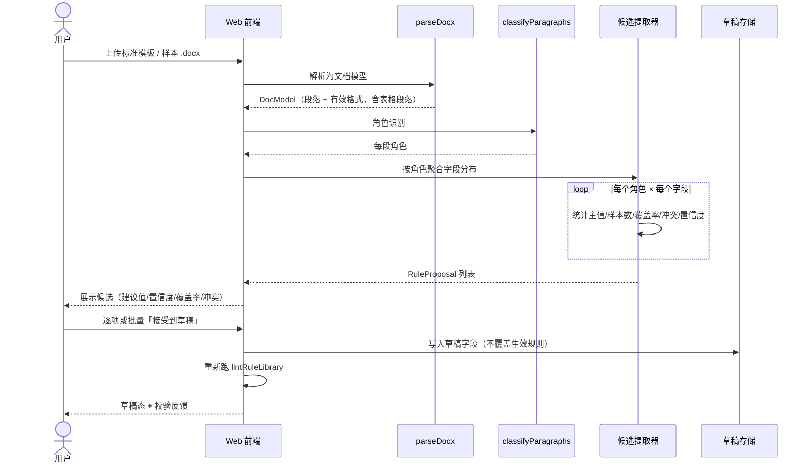

**说明**：把「人工写规则」升级为「自动提取 + 人工确认」；候选只进草稿，必须展示冲突与置信度。

---

## 图 9　Web Worker 异步检测（roadmap §5.4）

解析与校验移出主线程，大文档不阻塞 UI。

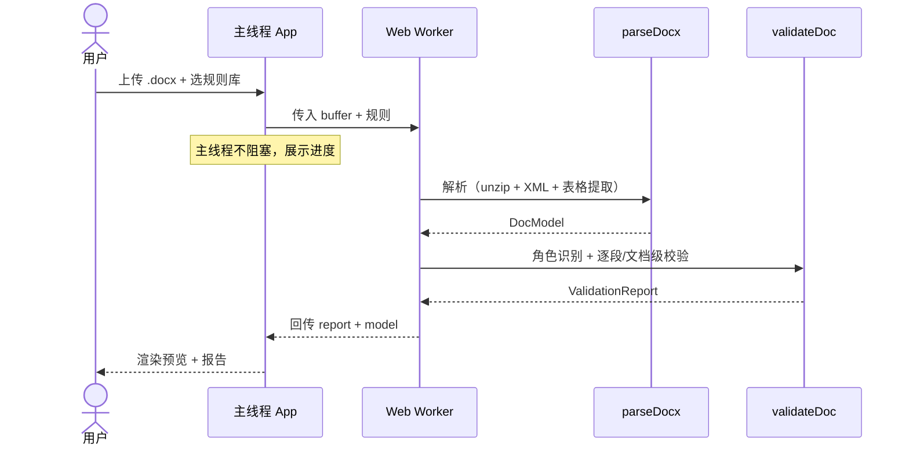

**说明**：同步 `unzipSync` + 全量解析会卡 UI；Worker 化是纯前端形态的体验刚需，不改检测逻辑。

---

## 图 10　带批注的 docx 导出（roadmap §5.1）

把问题作为 Word 批注回插——只加批注、不改正文。

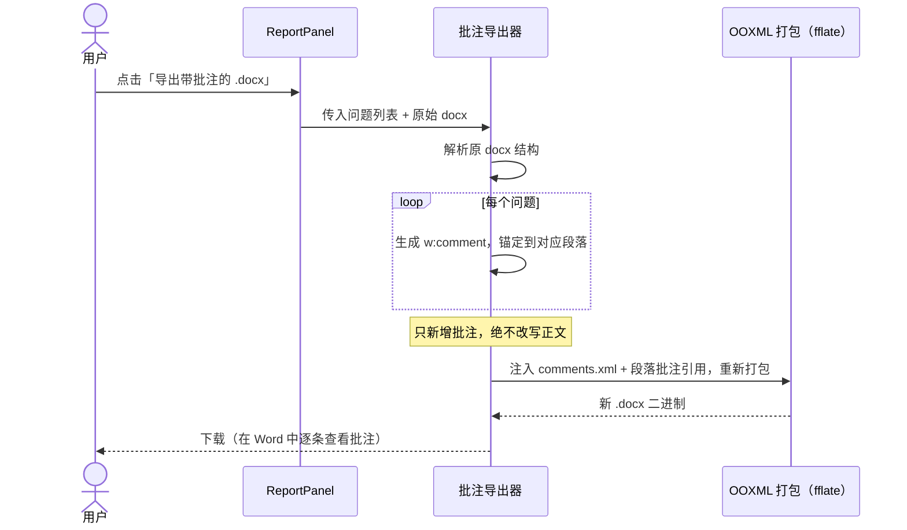

**说明**：高价值交付物，形成「看报告→改文档」闭环；不违背「绝不用 COM、不改写正文」根基。

---

## 图 11　问题下钻：规则依据 + 修复建议（roadmap §3.5）

点击问题展示其原始模板批注依据（`provenance`）与人话修复指引。

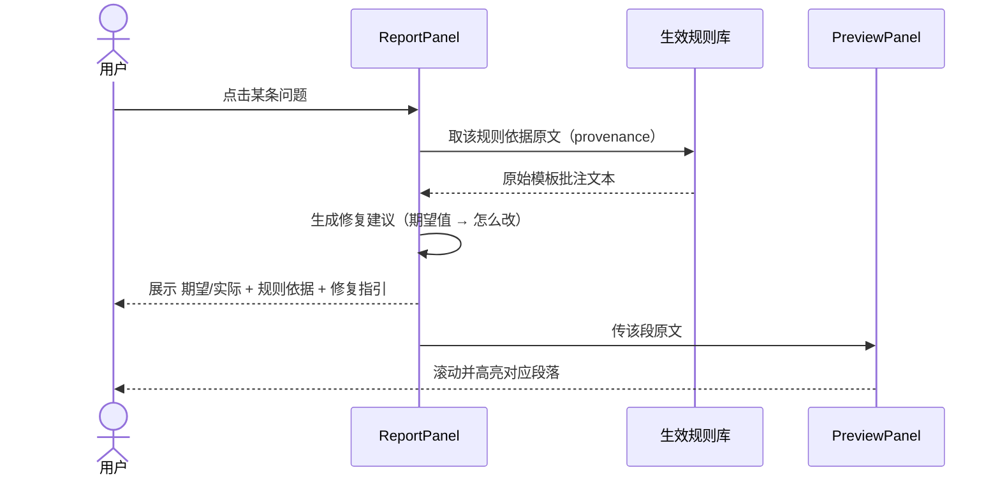

**说明**：规则库 JSON 的 `source.provenance` 已存每条规则的批注原文，目前未利用——展示它几乎零成本即可提升信任度。

---

## 标记约定

- **现有功能（图 1-5）**：已在代码库实现并经测试/对账验证（含本轮表格段落提取）。
- **新增功能（图 6-11）**：路线图规划，尚未实现；草稿存储、生效规则库、Web Worker、候选提取器、批注导出器为待建模块。
- **改造点**：图 7 的 `validateDoc` 由「降级到 legacy 单值」改为「直接消费 `RuleValue`」。
- 所有流程严守：纯 OOXML（无 Word COM）、检测与改写分离、规则可回溯依据、文件不离开浏览器。
